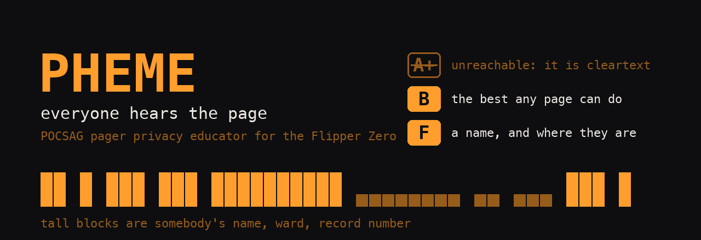
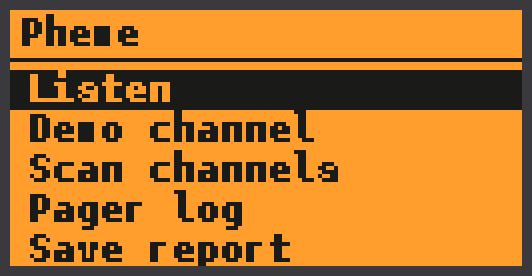
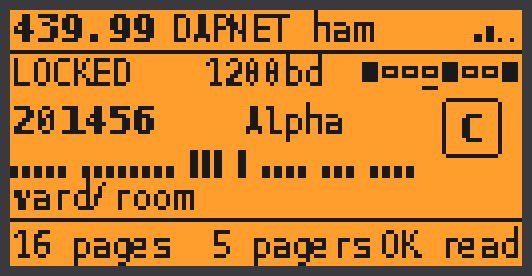
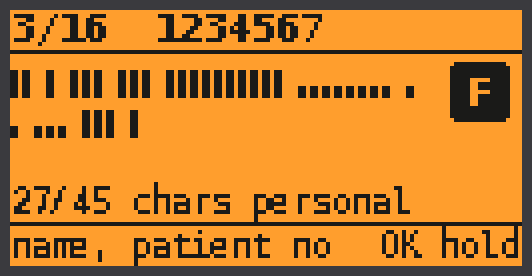
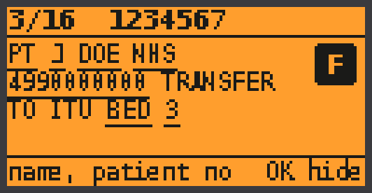
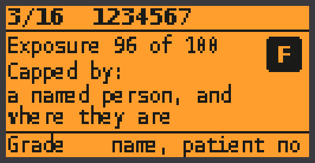
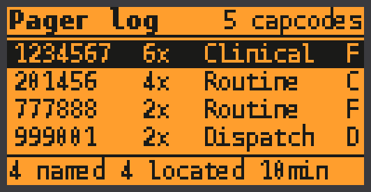
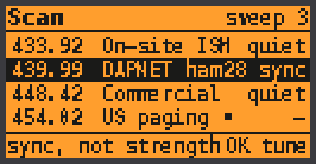
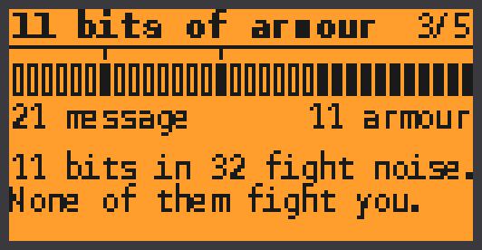
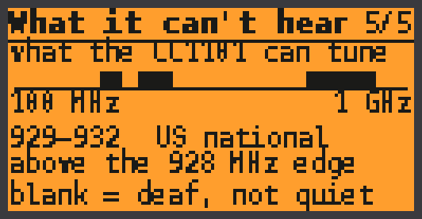

# Pheme

**A POCSAG pager privacy educator for the Flipper Zero.**

Hospitals still page. So do fire crews, plant rooms, care homes, security
patrols and the restaurant that hands you a coaster that buzzes when your table
is ready. They page over POCSAG, a protocol standardised in 1982 that has **no
encryption and no authentication of any kind** — not weak encryption, not
obsolete encryption, none. A page goes out in clear to every receiver within
range of the transmitter, and the capcode it is addressed to is a number burned
into one pager for the life of that pager.

Pheme listens to a paging channel, decodes what is on it, and grades how much of
somebody's afternoon just went out over the air. It shows you the *shape* of the
leak by default — never the words, unless you go out of your way to ask.

> Receive only. There is no transmit path in this application.

---

## What it looks like

| | | |
|:--:|:--:|:--:|
|  |  |  |
| The app | A page arriving | **Redacted by default** |
|  |  |  |
| Revealed, spans underlined | Why it scored that | One entry per capcode |
|  |  |  |
| Scanning for framing | The punchline | What it *cannot* hear |

Every screenshot above is rendered from the real decoder and the real grading
engine — `test/host_mockup_dump` runs the shipping code and prints what it
found, and `tools_gen_mockups.py` only draws it. They cannot drift away from
what the app actually does.

---

## The redaction skyline

The signature screen draws a message as one block per character: a **short**
block for ordinary text, a **full-height** block for anything the classifier
decided belongs to a person.

```
PT J DOE NHS 4990000000 TRANSFER TO ITU BED 3
██ █ ███ ███ ██████████ ▄▄▄▄▄▄▄▄ ▄▄ ▄▄▄ ███ █
```

You cannot read it. That is the point. You can see at a glance that twenty-seven
of forty-five characters are somebody's name, hospital number and bed — which is
the argument, and it can be made in a corridor or a lecture theatre without
putting a stranger's details on a screen.

Plain text is behind a setting that ships **off** and a deliberate long press.
Moving to the next page always re-hides it: revealing one message is not consent
to reveal the next.

---

## The grading scale, and why A+ cannot be earned

Every page gets a grade from what was found in it, and then that grade is pushed
up against floors it cannot duck under:

| Condition | Cannot score better than |
|---|---|
| It is a POCSAG page at all | **B** |
| It names a real place, callback or event | **C** |
| A person can be identified from it | **D** |
| A named person **and** where they are | **F** |
| A code that opens something | **F** |

The first row is the one that matters. A tone-only page — a pager that beeps and
says nothing whatsoever — still scores B, because it went out unauthenticated to
every receiver in range and it told a listener *which pager was called, and
when*. There is no such thing as a private POCSAG page, so there is no A.

Floors are applied by **compressing** the score into the range above them, never
by clipping. Clipping would make every page in a category score identically, and
the ordering between two F-graded pages would then come from nothing but the
order the detectors happened to run in.

---

## The uncomfortable part: capcodes

A capcode is not a session token. It does not rotate. It is a 21-bit number in
the pager on somebody's belt and it will be the same number next year.

The Pager Log keeps one entry per capcode, and doing so assembles things nobody
transmitted. In the test suite there is a capcode paged five times in four
minutes where **not one page is worse than a D** — the page that names somebody
does not say where they are, and the pages that give a ward do not say who is on
it. Follow the capcode and the union is a name, a location and a medical
context: a description of one person's afternoon, built out of fragments that
each looked survivable alone.

Nobody sent that profile. A listener built it for free, left no trace on the
network, and needed no more than a thirty-pound radio.

---

## Honest limits

**This is the section to read before you decide the band is quiet.**

- **Coverage.** The CC1101 tunes 300–348, 387–464 and 779–928 MHz. That reaches
  on-site paging, amateur POCSAG and part of the US 454 MHz band. It does **not**
  reach VHF paging at 138–174 MHz (UK national paging at 153 MHz, Dutch P2000 at
  169.65 MHz), UK and European commercial paging at **466 MHz — two megahertz
  above the chip's upper edge** — or US national paging at 929–932 MHz. A great
  deal of what this app is about lives on channels it physically cannot hear,
  and the coverage lesson says so on screen.
- **FLEX is not decoded.** It is a different protocol at a different rate with a
  different modulation. Pheme decodes POCSAG at 512, 1200 and 2400 bps and
  nothing else.
- **Never tested against a live paging transmitter.** The protocol layer is
  tested exhaustively on the host against a generator that produces real POCSAG
  framing, and the .fap builds and runs — but no page in this repository has come
  off a real base station. If it does not lock on a channel you know is active,
  that is the first thing to suspect.
- **The narrow filter is a setting, not the default.** POCSAG fits in about
  eleven kilohertz and the stock 2FSK preset opens the receive filter far wider,
  so there is a custom register set that tightens it to the CC1101's 58 kHz
  minimum. It is opt-in precisely because it is unverified on hardware, and a
  preset that does not work is much worse than one that merely works less well.
- **All demo content is invented.** Every name, number and address in demo mode
  is fabricated, and the telephone numbers are in the 555-01xx range reserved for
  fiction. The point is what the *format* leaks, and that point does not need a
  real person's details to land.

---

## Channels

| Frequency | Used for |
|---|---|
| 433.920 MHz | On-site ISM paging — coaster pagers, nurse call, industrial |
| **439.9875 MHz** | DAPNET amateur POCSAG, worldwide (default) |
| 448.425 MHz | European commercial paging |
| 454.025 / 454.475 / 454.650 MHz | US one-way paging |
| 462.850 MHz | US on-site paging |
| 868.350 MHz | European on-site ISM |

**Scan** hops these counting **POCSAG synchronisation**, not signal strength. A
power sweep finds the loudest carrier, which on any real site is a data link or
a repeater and never the pager base station. A channel with a strong signal and
no paging on it correctly reads *quiet*.

---

## How it works

The Flipper firmware has no POCSAG decoder, so this is the whole thing, written
from scratch and compiled unchanged on the host so it can be tested properly.

```
preamble       576 bits of 1010...      wakes a sleeping pager
sync codeword  0x7CD215D8               marks a batch
batch          8 frames x 2 codewords   512 bits
sync codeword  ...and so on
```

- **Rate detection by racing.** Three decoders run in parallel, one per standard
  rate, each converting the same run-length stream into bits with its own bit
  period and hunting for the sync word. Whichever locks *is* the rate. Trying to
  measure the rate first is how a histogram of run lengths ends up wrong by a
  factor of two.
- **Capcodes come from position.** Only the top 18 bits of a 21-bit capcode
  travel in the address codeword; the bottom 3 are the *frame number* it landed
  in. That is the trick that lets a pager sleep through seven eighths of every
  batch — a power-saving measure that gets mistaken for a privacy one.
- **BCH(31,21) with a syndrome table.** Correction runs inside the Sub-GHz worker
  callback, which cannot afford 496 syndrome evaluations per codeword, so the
  1024-entry error-pattern table is built once at startup.
- **A lost codeword leaves a hole, not a shift.** Twenty placeholder bits go in
  where an unrecoverable word was, because dropping them silently would move
  every following character by five bit positions and turn one lost codeword
  into an unreadable remainder. The count is reported, so a damaged page is
  labelled damaged rather than quietly shown as rubbish.

And the line the whole app is built around, from lesson 3:

> POCSAG spends **11 of every 32 bits** protecting a page from noise.
> It spends **none at all** protecting it from you.

---

## Build

Needs [ufbt](https://github.com/flipperdevices/flipperzero-ufbt).

```bash
ufbt
```

The .fap lands in `dist/`. To build and launch on a connected Flipper:

```bash
ufbt launch
```

## Tests

The protocol and the grading engine are pure C with no `furi_` headers, so the
code under test is literally the code that ships. Everything runs under
AddressSanitizer and UndefinedBehaviorSanitizer.

```bash
make -C test
```

```
pocsag:  52069474 checks, 0 failed
privacy:   958697 checks, 0 failed
roster:        108 checks, 0 failed
```

What that actually covers:

- Every one- and two-bit error applied to a decimated sweep of the whole 21-bit
  information space — 15 million corrections — plus a check that **no three-bit
  error is ever "corrected" back to a different valid codeword**.
- Text round-tripped through encoder, air, and decoder at all three rates,
  across all eight frame positions and both alphabets.
- A fifth of a bit period of clock jitter on every edge, at every rate.
- 400,000 runs of pure noise, which must produce **zero** pages. A privacy tool
  that invents leaks is worse than useless.
- Heavy random damage across a hundred scatterings, asserting the property that
  matters: a page whose text did not survive is **never** handed over looking
  clean. Silence is an acceptable answer; a confident wrong answer is not.
- 200,000 randomly generated messages through the classifier and redactor, since
  a page off the air is not a well-formed sentence and the classifier runs on a
  worker thread that does not get to crash.

To regenerate the screenshots after changing anything:

```bash
make -C test mockup && python3 tools_gen_mockups.py
```

---

## Use it lawfully

Receiving is not legal everywhere, and acting on what you hear is legal almost
nowhere. Pheme exists to make the case for encrypted messaging in the places
that still page in clear — to give someone a screen they can show a facilities
manager or an IT director. It is not built to read anybody's afternoon, which is
why the message text is hidden by default, why the SD-card report is redacted
before it is written, and why there is no transmit path in the app at all.

---

## Licence

MIT. See [LICENSE](LICENSE).

Built by [at0m-b0mb](https://github.com/at0m-b0mb).
